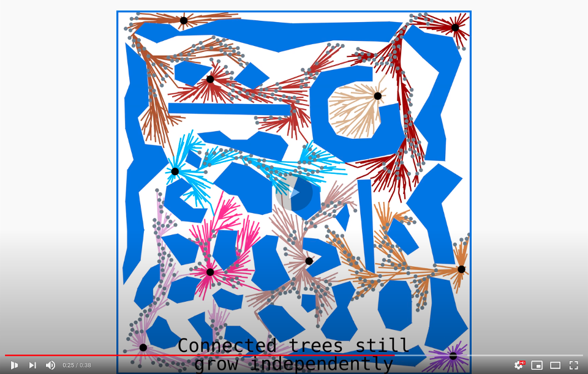

[](https://youtu.be/vBQVO_GP5Sc)

# Space-Filling Forest*
This repository contains source codes, maps and models reffered in *"Multi-goal path planning using multiple random trees"* paper for the Space-Filling Forest* (SFF*) algorithm. Additionally, it also includes source codes for other tested methods -- RRT, RRT* and Multi-T-RRT. 
SFF* is a novel sampling-based planner for multi-goal path planning among obstacles, where the objective is to visit predefined target locations while minimizing the travel costs.   


# Dependencies
Most of the dependencies are already include in the `lib` folder (FLANN for nearest neighbours search & RapidXML for parsing of the configuration file), however there are other dependencies, which you must install on your own:
 * **GCC compiler** -- CLANG can be used as well, you only need to change the `makefile`. Version of the used code is c++17, please download the proper versions of compilers on your own.
 * **GMP** -- more info [here](https://gmplib.org/).
 * **RAPID library** -- this library could not be included for its licensing terms, even though it is free to use for non-commercial projects. You can request your own copy [here](http://gamma.cs.unc.edu/OBB/). After obtaining one, insert the source code to the `lib/rapid-2.0.1` folder, it will be automatically compiled in the next step
 * **Handler of TSP Solvers obst_tsp** -- this handler is required for the implementation of `Lazy TSP` algorithm. However, if you are interested only in the Space Filling Forest algorithm, you don't need to install this one. The handler is not publicly available, but feel free to contact us for further informations.

# How to compile
After inserting the RAPID source code to the folder specified in the previous step, run compilation of all dependencies by
```
make install
```
After successfull compilation of dependencies, run
```
make
```
This will create executable file `main` in the folder `release`.

# How to run the compiled program
The compiled executable might be executed by calling
```
./release/main configuration-file [iteration-id]
```
The iteration-id argument is optional and it is used only for proper file indexing. Structure of the required configuration file is described in the next section. You can also use prepared example files `test_2D.xml`, `test_building.xml` or `test_triang.xml`.

# Input/Output graphic files
The program accepts standard OBJ files or specialized 2D tri files. It is a plain text file, each row might represent point, line, or triangle:
 - line in format `x y` is a point
 - line in format `x1 y1 x2 y2` is a line
 - line in format `x1 y1 x2 y2 x3 y3` is a triangle

 The program outputs standard OBJ files or specialized 3D tri files (please note the difference). The format is similar to the 2D tri files, however each point is represented by 6 values (position & Euler angles): `x y z yaw pitch roll`. Therefore, each line consists from up to 18 values.

# Structure of the configuration file
Each file must have precisely one `<Problem />` node. If more nodes are specified, only the first one is processed.
***

### Problem

  **Ancestor**: none
  
  **Required**: yes

  **Attributes**:

- *solver:* required, type of solver -- either `sff`, `rrt` or `lazy` (case sensitive)
- *optimize:* required, whether to use optimal version of solver (i.e. RRT* or SFF*)
- *smoothing:* optional, whether to smooth the path in the end of the solution, not implemented for Lazy-TSP solver
- *scale:* optional, ratio of length units to radians, default value is 1, recommended value for 3D cases is 10
- *dim:* optional, dimensionality of the problem -- either `2d` or `2D` for 2D cases, `3d` or `3D` for 3D cases (default)

***

### ObjectDelimiters

  **Ancestor**: `<Problem />`

  **Required**: no
  
  **Attributes**:
  
- *standard:* optional, delimiter used in obstacle files, default is `" "`
- *name:* optional, delimiter of obstacle name in OBJ file (`o` object) default is `"_"`

***

### TSP

  **Ancestor**: `<Problem />`

  **Required**: only for Lazy TSP solver
  
  **Attributes**:
  
- *path:* required, path (absolute or relative) to obst_tsp handler executable
- *type:* required, type of the TSP solver, must be suported by obst_tsp handler (e.g. `"Concorde"`, `"LKH"`)

***

### Robot

  **Ancestor**: `<Problem />`

  **Required**: yes

  **Attributes**:

- *file:* required, path to file with robot model (either tri or OBJ)
- *is_obj:* optional, whether the previous file is in OBJ format, default is __false__

***

### Environment

  **Ancestor**: `<Problem />`

  **Required**: no

  **Attributes**:

- *collision:* required, sampling distance for collision checker (i. e. local planner)

***

### Obstacle

  **Ancestor**: `<Environment />`

  **Required**: no

  **Attributes**:

- *file:* required, path to file with obstacle (either 2D `tri` or `OBJ` file)
- *position:* optional, point in format `[x; y; z]`, determines position of the model in the environment (note that the z coordinate is required also in 2D cases)
- *is_obj:* optional, whether the previous file is in OBJ format, default is __false__

***

### Points

  **Ancestor**: `<Problem />`

  **Required**: yes

  **Attributes**:

- none

***

### Point

  **Ancestor**: `<Points />`

  **Required**: at least one

  **Attributes**:

- *coord:* required, coordinates of the "starting" node (node to expand) or nodes in case of multipath planning in format `[x; y; z]` (note that the z coordinate is required also in 2D cases)

***

### Goal
  
  **Ancestor**: `<Problem />`

  **Required**: no (note that multi-source planning with one goal is not tested & single-path planning is not defined for Lazy TSP solver)

  **Attributes**:

- *coord:* required, coordinates of the goal node (not expanding node) in format `[x; y; z]` (note that the z coordinate is required also in 2D cases) 

***

### Range

  **Ancestor**: `<Problem />`

  **Required**: yes

  **Attributes**:

- *autoDetect:* optional, detects the sampling range from obstacles

***

### RangeX/RangeY/RangeZ

  **Ancestor**: `<Range />`

  **Required**: when not in autoDetect mode, otherwise used as a minimum range

  **Attributes**:

- *min:* required, boundary for given coordinate, used for sampling boundaries of the environment
- *max:* required, boundary for given coordinate, used for sampling boundaries of the environment

***

### Distances

  **Ancestor**: `<Problem />`

  **Required**: yes

  **Attributes**:

- *dtree:* required, minimal distance between single trees
- *circum:* required, sampling distance for tree nodes

***

### Improvements

  **Ancestor**: `<Problem />`

  **Required**: no

  **Attributes**:

- *priorityBias:* optional, whether to use standard frontier or priority queue (value is float, probability of using priority queue)

***

### Thresholds

  **Ancestor**: `<Problem />`

  **Required**: no

  **Attributes**:

- *standard:* optional, number of misses in sampling (child is closer to another node) to remove the node from frontier, default is 3

**Note:**
Thresholds have effect only for SFF.

***

###  MaxIterations

  **Ancestor**: `<Problem />`

  **Required**: yes

  **Attributes**:

- *value:* required, maximum number of iterations - note that in the case of Lazy TSP the maximum number of iterations is furthermore multiplied by the number of points/roots

***

### Save

  **Ancestor**: `<Problem />`

  **Required**: no

  **Attributes**:

- none

***

### Goals/Tree/RawPath/SmoothPath/Params/TSP/Frontiers

  **Ancestor**: `<Save />`

  **Required**: no

  **Attributes**:

- *file:* required, path where to save generated OBJ/3D map files (or plain-text files in case of Params and TSP)
- *is_obj:* **NOT FOR PARAMS & TSP**, optional, whether the previous file should be in OBJ format, default is __false__
- *everyIteration:* **ONLY TREE & FRONTIERS SUBNODES**, optional, enables saving of the developing tree and/or its frontiers, every x-th iteration, value 0 = disabled
- *id:* **ONLY PARAMS SUBNODE**, optional, id of the current configuration, string

**Notes**:

- *Goals:* Input goal points
- *Tree:* List of trees, their nodes, connections and iteration, when the node was created
- *RawPath:* Found shortest paths between goals, before smoothing
- *SmoothPath:* Found shortest paths between goals, after smoothing - smoothing must be enabled (see Problem node)
- *Params:* ID of instance and iteration, number of iterations, whether the problem was solved, distances between points and elapsed time
- *TSP:* File in format accepted by the obst_tsp TSP handler, enables easy additional computation of best TSP path
- *Frontiers:* Only for SFF based solvers - list of all active nodes