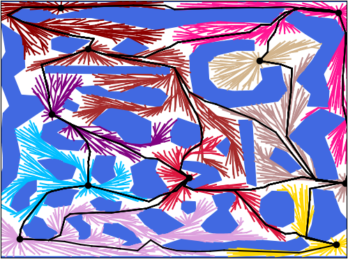

**This branch contains code modified for computations in higher dimensions. This version is still being developed, therefore it is NOT STABLE!**
# Space-Filling Forest*
This repository contains source codes, maps and models reffered in *"Multi-goal path planning using multiple random trees"* paper for the Space-Filling Forest* (SFF*) algorithm. Additionally, it also includes source codes for other tested methods -- RRT, RRT* and Multi-T-RRT. 
SFF* is a novel sampling-based planner for multi-goal path planning among obstacles, where the objective is to visit predefined target locations while minimizing the travel costs.   

